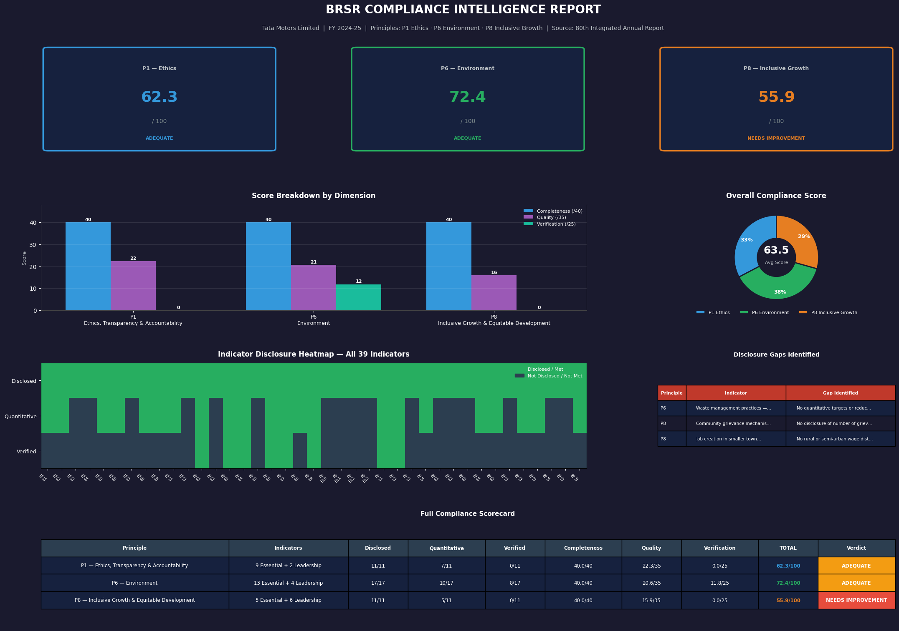

# BRSR Compliance Analyzer
### Tata Motors Limited | FY 2024-25 | Principles 1, 6 & 8



---

## Overview

A Python-based **BRSR (Business Responsibility & Sustainability Reporting) Compliance Analyzer** that systematically scores a listed Indian company's sustainability disclosures against SEBI's mandatory reporting framework.

This tool reads real disclosure content from a company's BRSR report, scores each indicator across three analytical dimensions, identifies disclosure gaps, and produces a board-ready compliance intelligence dashboard.

**Company Analyzed:** Tata Motors Limited (TML, TMPVL, TPEML)  
**Reporting Year:** FY 2024-25 (80th Integrated Annual Report)  
**Principles Covered:** P1 (Ethics), P6 (Environment), P8 (Inclusive Growth)  
**Total Indicators Assessed:** 39 (27 Essential + 12 Leadership)

---

## Why This Matters

BRSR is mandatory for India's top 1000 listed companies under SEBI's circular (FY2022-23 onwards). As the framework matures — with BRSR Core introducing third-party assurance requirements — the gap between companies that disclose and companies that disclose *credibly* is widening.

This analyzer operationalises that distinction. It doesn't measure a company's actual environmental or social performance. It measures the **quality and credibility of their disclosure** — which is what regulators, ESG rating agencies, and investors actually rely on.

---

## Scoring Methodology

Each indicator is scored across three dimensions:

| Dimension | Weight | Criteria |
|-----------|--------|----------|
| **Completeness** | 40 pts | Was the indicator disclosed at all? |
| **Quality** | 35 pts | Is the disclosure quantitative and specific? |
| **Verification** | 25 pts | Was it externally assured by a third party? |
| **Total** | 100 pts | Sum of all three dimensions |

**Verdict thresholds:**
- **STRONG** — Score ≥ 80
- **ADEQUATE** — Score 60–79
- **NEEDS IMPROVEMENT** — Score < 60

**Why these weights?** Completeness is weighted highest because disclosure is the baseline regulatory requirement. Quality is weighted almost as much because vague narrative disclosures are analytically useless. Verification is weighted lowest because external assurance remains voluntary under current BRSR — though BRSR Core is changing this.

---

## Results — Tata Motors FY2024-25

| Principle | Indicators | Disclosed | Quantitative | Verified | Score | Verdict |
|-----------|-----------|-----------|--------------|----------|-------|---------|
| P1 — Ethics, Transparency & Accountability | 11 | 11/11 | 7/11 | 0/11 | **62.3/100** | ADEQUATE |
| P6 — Environment | 17 | 17/17 | 10/17 | 8/17 | **72.4/100** | ADEQUATE |
| P8 — Inclusive Growth & Equitable Development | 11 | 11/11 | 5/11 | 0/11 | **55.9/100** | NEEDS IMPROVEMENT |
| **Overall Average** | **39** | **39/39** | **22/39** | **8/39** | **63.5/100** | **ADEQUATE** |

---

## Key Findings

**P6 scores highest (72.4)** because Tata Motors has KPMG external assurance on 8 of 17 environment indicators — covering energy, water, GHG emissions, air quality, and waste. This directly drives the verification score and reflects Tata's voluntary adoption of BRSR Core ahead of mandatory timelines.

**P1 scores adequately (62.3)** with complete disclosure across all governance indicators and strong quantitative data — but zero external assurance. Governance disclosures are self-reported, which limits their credibility for institutional investors.

**P8 scores lowest (55.9)** because social indicators are predominantly qualitative narrative. CSR beneficiary numbers are disclosed but most community and procurement indicators lack quantification, and none are externally verified.

---

## Disclosure Gaps Identified

| Principle | Indicator | Gap |
|-----------|-----------|-----|
| P6 | Waste management practices — hazardous chemicals | No quantitative targets or reduction metrics provided — disclosure is narrative only |
| P8 | Community grievance mechanisms | No disclosure of number of grievances received, resolved, or pending |
| P8 | Job creation in smaller towns | No rural or semi-urban wage distribution — 100% of employment concentrated in urban and metropolitan locations |

---

## Dashboard Components

The compliance intelligence dashboard contains 5 panels:

**1. KPI Score Cards** — Total score per principle with colour-coded verdict (green = strong, amber = adequate, red = needs improvement)

**2. Score Breakdown by Dimension** — Grouped bar chart showing completeness, quality, and verification scores side by side for each principle

**3. Overall Compliance Donut** — Relative score distribution across the three principles with average score in the centre

**4. Indicator Disclosure Heatmap** — A 3×39 matrix showing every indicator across all three dimensions — the most information-dense view in the report. Green = disclosed/met, dark = not met. The near-empty Verification row reflects that external assurance is currently limited to P6 under BRSR Core.

**5. Full Compliance Scorecard Table** — Complete numerical breakdown of every score component, audit-ready format

---

## Data Sources

All indicator assessments are based on primary source reading of the Tata Motors BRSR FY2024-25 report:

| Source | Used For |
|--------|----------|
| Tata Motors 80th Integrated Annual Report (2024-25) | All indicator disclosures |
| SEBI BRSR Framework (2021, amended 2023) | Indicator definitions and requirements |
| SEBI BRSR Core circular (December 2024) | External assurance requirements |
| KPMG Assurance statements (embedded in BRSR) | Verification scoring |

---

## Limitations

1. **Analyst judgment involved** — Scoring qualitative vs quantitative disclosure requires interpretation. Two analysts may score the same indicator differently at the margin.

2. **Only 3 of 9 principles covered** — P2 (Products), P3 (Employees), P4 (Stakeholders), P5 (Human Rights), P7 (Policy), and P9 (Consumers) are not yet included. Full 9-principle coverage is planned.

3. **Single company** — This is a case study, not a benchmark. Comparative value increases when multiple companies are scored on the same framework.

4. **FY2024-25 only** — No year-on-year trend analysis yet. Multi-year tracking would reveal whether disclosure quality is improving.

---

## Repository Structure

```
brsr-compliance-analyzer/
│
├── BRSR_Compliance_Analyzer.ipynb        # Main analysis notebook
├── BRSR_Compliance_Report_TataMotors_FY25.png   # Dashboard output
├── README.md                              # This file
└── methodology/
    └── SCORING_METHODOLOGY.md            # Detailed scoring rationale
```

---

## How to Use This for Another Company

1. Download the target company's BRSR from their investor relations page
2. Open `BRSR_Compliance_Analyzer.ipynb` in Google Colab
3. In Cell 3, replace the `indicators` dictionary with your new company's disclosure assessments
4. Update the company name and year in Cell 5 dashboard headers
5. Run all cells — the dashboard generates automatically

The scoring engine (Cell 4) requires no changes. Only the indicator data changes per company.

---

## Planned Enhancements

- [ ] Full 9-principle coverage
- [ ] Multi-company benchmarking — score 5 Indian companies side by side
- [ ] Year-on-year trend analysis
- [ ] Automated gap prioritisation by materiality
- [ ] Power BI interactive layer on top of Python scoring engine
- [ ] PDF report export

---

## About

Built by **Sajjad Ahmed** — CS & AI Engineer | Building Data Tools for Sustainability | SCR® Certified (GARP)

This project is the second in a series of open-source sustainability data tools:

**Related Projects:**
- [GHG Emissions Intelligence Calculator](https://github.com/sajjad-ahmed20/ghg-emissions-calculator) — Scope 1, 2 & 3 calculator with Power BI dashboard and Net Zero scenario modelling
- [CSRD-ESRS & GRI Framework Mapping](https://github.com/sajjad-ahmed20/esrs-gri-framework-mapping) — Comparative analysis of ESRS E1 and GRI Standards

**Contact:** sajjadahmed.mubeen2@gmail.com | [LinkedIn](https://www.linkedin.com/in/sajjad-ahmed-40159b250/) | [GitHub](https://github.com/sajjad-ahmed20)

---

*Indicator assessments based on primary reading of Tata Motors BRSR FY2024-25. Scoring reflects disclosure quality, not operational sustainability performance. For regulatory submissions, consult a certified sustainability assurance provider.*
